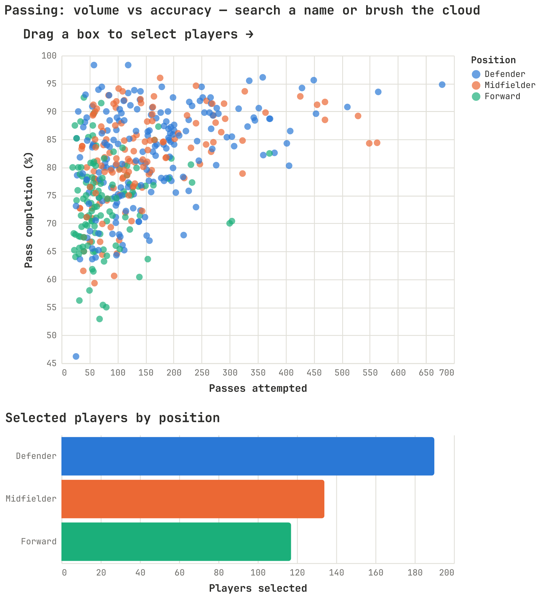

# Altair chart cookbook

This abbreviated build ships one chart: **Passing: volume vs accuracy**. Below
is the core Altair code behind it, then the one-call shortcut. Every chart first
picks up the shared look with:

```python
import altair as alt
from msds_comms_plotter import chartkit
chartkit.enable_altair_theme()   # JetBrains Mono, shared palette, minimal chrome
```

Data comes from the processed table built by
[`worldcup.py`](../src/msds_comms_plotter/worldcup.py); see
[`wc2022_data.md`](wc2022_data.md) for columns.

---

## Passing: volume vs accuracy — linked brush (`selection_interval`)

Altair's signature interaction. Drag a box on the scatter (passes attempted vs
pass completion %, colored by position) and the count-by-position bars below
recount only the selected players; the rest fade to grey. One selection drives
both marks. The full builder adds a player-name search box and a live
color-scheme dropdown on top.



```python
brush = alt.selection_interval()
color = alt.Color("position:N")

points = alt.Chart(players).mark_point(filled=True).encode(
    x="passes:Q", y="completion_pct:Q",
    # selected points keep their category color; the rest go grey
    color=alt.when(brush).then(color).otherwise(alt.value("lightgray")),
).add_params(brush)

bars = alt.Chart(players).mark_bar().encode(
    y="position:N", x="count():Q", color=color,
).transform_filter(brush)          # only the brushed points are counted

points & bars                      # vertical concatenation
```

---

## Shortcut: just call the library

You don't have to reproduce the code above — the full passing chart (brush,
player-name search box, color-scheme dropdown, and the linked count-by-position
bars) is one function call:

```python
from msds_comms_plotter import altair_charts as ac

chart = ac.linked_scatter_passing()   # uses the bundled data; returns an alt.Chart
chart.save("passing.html")            # or just `chart` in a notebook
# pass your own table with: ac.linked_scatter_passing(stats=my_df)
```

Or run the example, which builds it and opens it in your browser:

```bash
python examples/show_wc2022_charts.py
```

## Saving a chart

Any chart is an `alt.Chart`; save it as interactive HTML or a static PNG:

```python
chart.save("chart.html")            # interactive; add inline=True for offline
chart.save("chart.png", ppi=200)    # needs vl-convert-python (the [png] extra)
```
