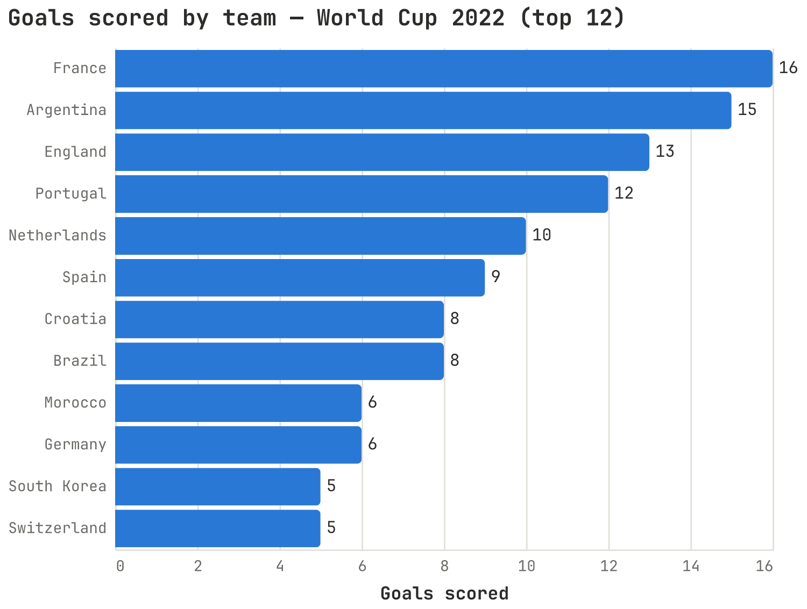
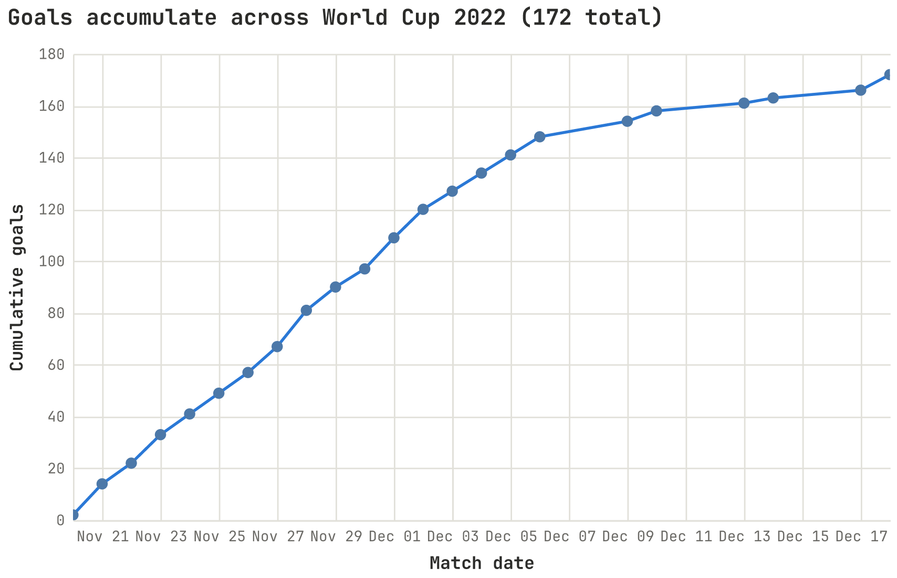
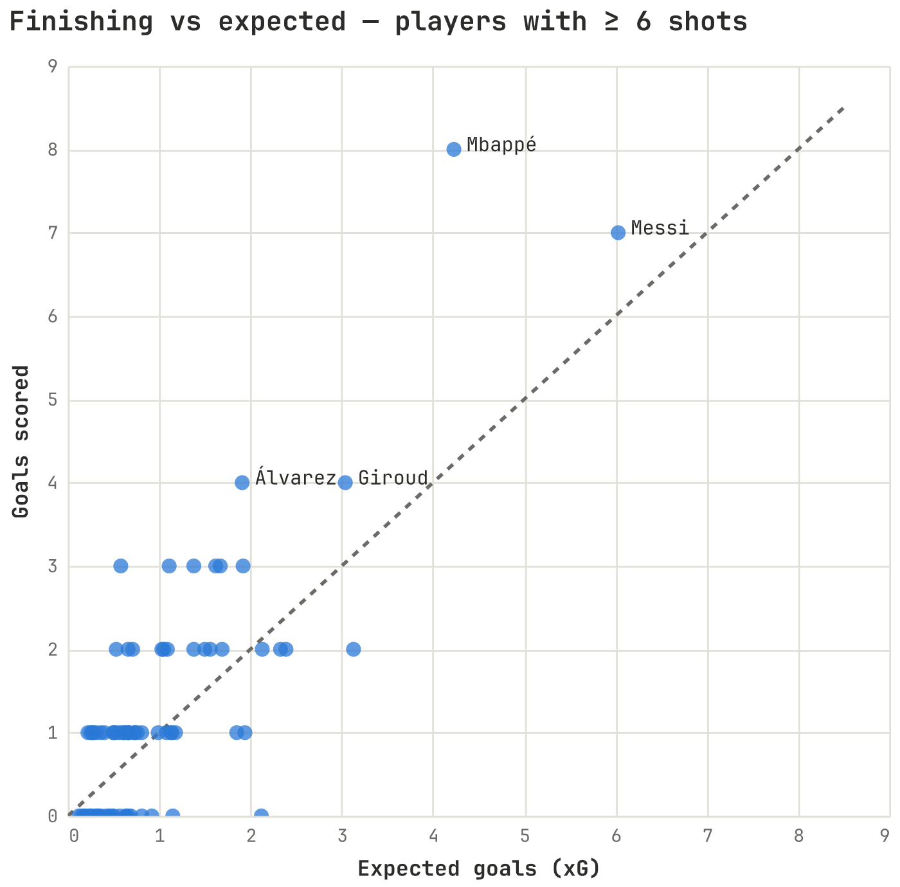
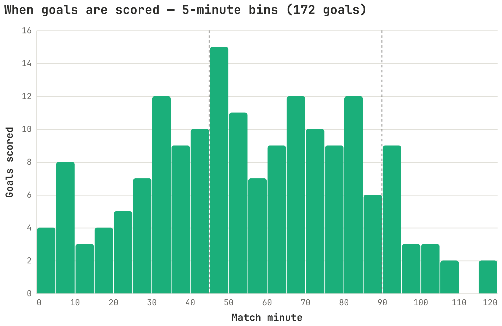
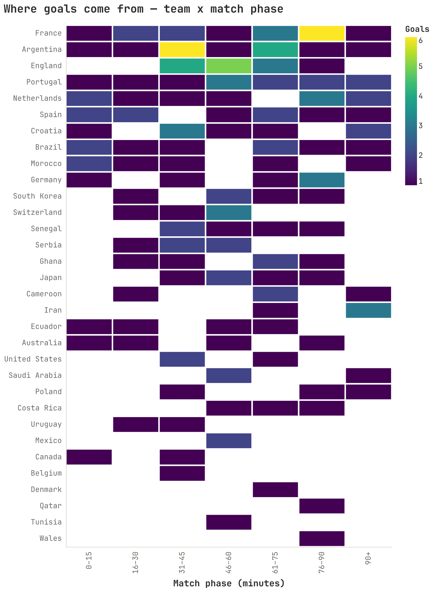
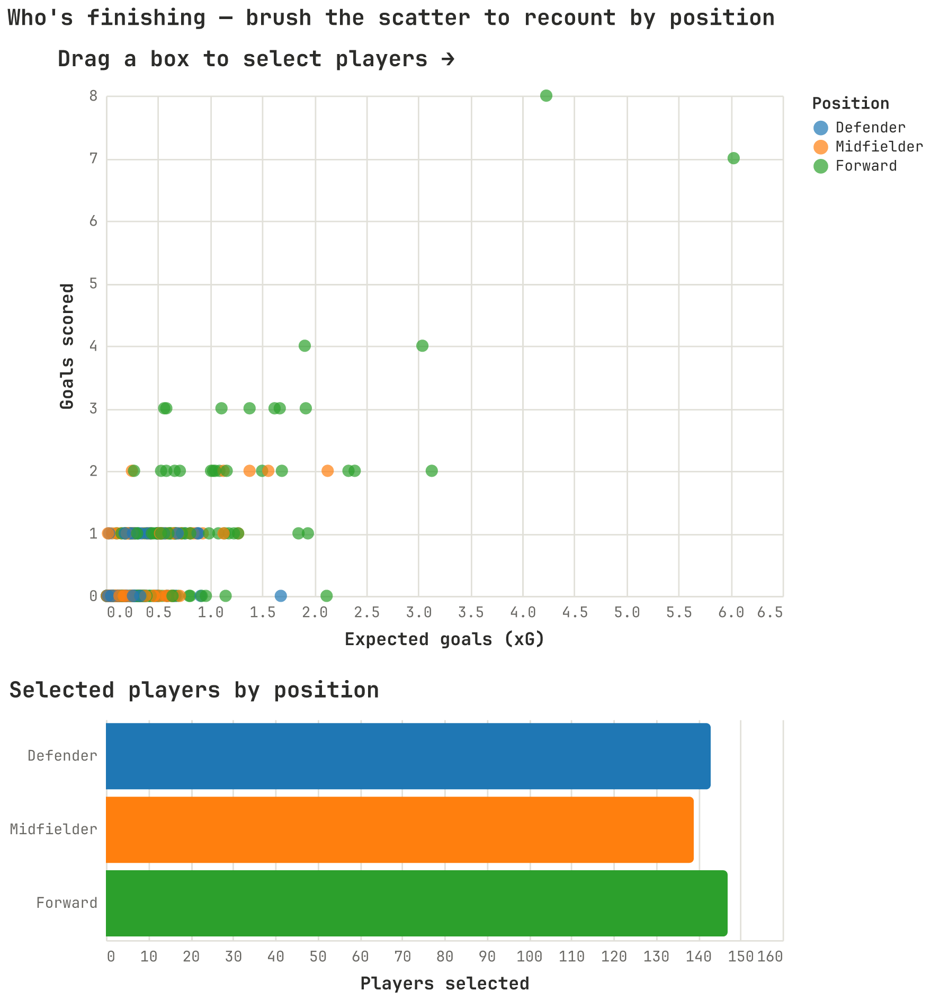
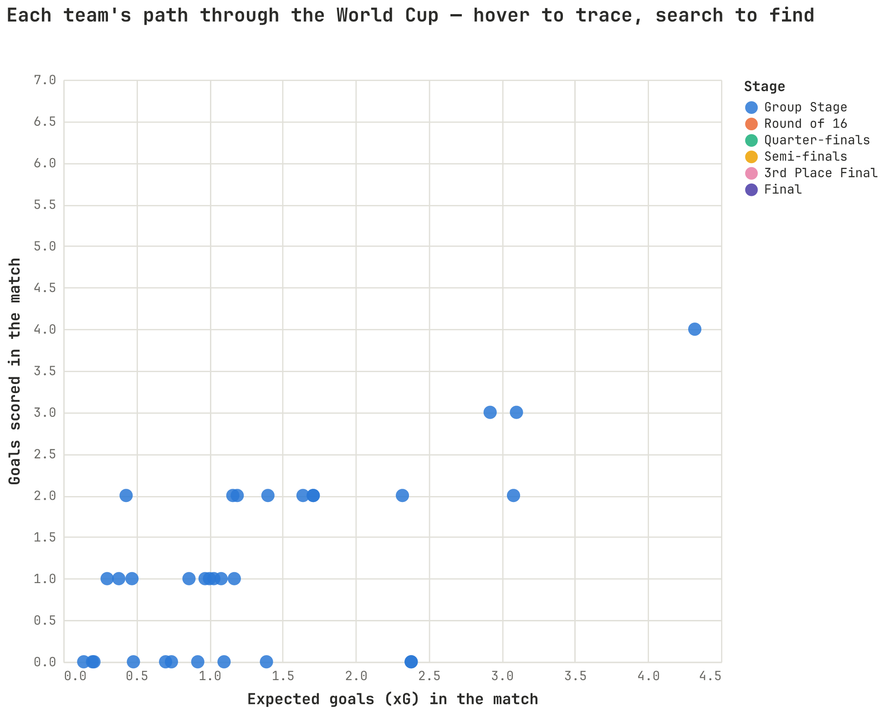
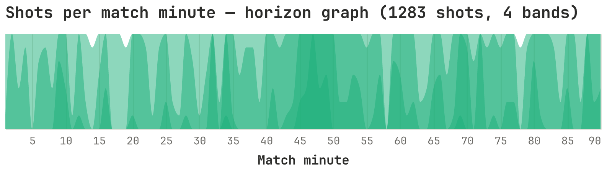

# Altair chart cookbook

One recipe per chart type used in this project: what it looks like, and the
core Altair code to build it. The snippets are trimmed to the essential
`mark` + `encode` so the technique is clear — the full themed, interactive
versions live in
[`msds_comms_plotter.altair_charts`](../src/msds_comms_plotter/altair_charts.py)
(call `ac.bar_goals_by_team()`, `ac.line_cumulative_goals()`, …). Every chart
first picks up the shared look with:

```python
import altair as alt
from msds_comms_plotter import chartkit
chartkit.enable_altair_theme()   # JetBrains Mono, shared palette, minimal chrome
```

Data comes from the processed tables and the event builders in
[`worldcup.py`](../src/msds_comms_plotter/worldcup.py); see
[`wc2022_data.md`](wc2022_data.md) for columns.

---

## 1. Bar chart — `mark_bar`

Magnitude across a category. One measure, one categorical axis, single hue;
rank is carried by length and the sort order.



```python
# by_team: columns "team", "goals"
alt.Chart(by_team).mark_bar().encode(
    x=alt.X("goals:Q", title="Goals scored"),
    y=alt.Y("team:N", sort="-x", title=None),   # sort teams by the x value
)
```

---

## 2. Line chart — `mark_line`

Change over time. Here goals are summed per match-day and accumulated into a
monotone curve. `point=True` marks each observation.



```python
# daily: columns "match_date" (datetime), "cumulative_goals"
alt.Chart(daily).mark_line(point=True).encode(
    x=alt.X("match_date:T", title="Match date"),
    y=alt.Y("cumulative_goals:Q", title="Cumulative goals"),
)
```

---

## 3. Scatter plot — `mark_point`

Relationship between two continuous measures — one dot per record.



```python
# players: columns "xg", "goals"
alt.Chart(players).mark_point(filled=True, size=70).encode(
    x=alt.X("xg:Q", title="Expected goals (xG)"),
    y=alt.Y("goals:Q", title="Goals scored"),
)
```

Add a `y = x` reference line by layering a second chart:

```python
diag = alt.Chart(alt.Data(values=[{"v": 0}, {"v": 9}])).mark_line(
    strokeDash=[4, 4]).encode(x="v:Q", y="v:Q")
chart = diag + points
```

---

## 4. Histogram — `mark_bar` with `bin`

Distribution of a *continuous* variable: bin it, then count. A histogram is a
bar chart whose x is binned.



```python
# goals: one row per goal, column "minute"
alt.Chart(goals).mark_bar().encode(
    x=alt.X("minute:Q", bin=alt.Bin(step=5), title="Match minute"),
    y=alt.Y("count():Q", title="Goals scored"),   # count() aggregates per bin
)
```

---

## 5. Heatmap — `mark_rect`

Two categorical axes with a magnitude in each cell, shaded by a **sequential**
color ramp.



```python
# counts: columns "team", "phase", "goals"
alt.Chart(counts).mark_rect(stroke="white", strokeWidth=2).encode(
    x=alt.X("phase:N", title="Match phase"),
    y=alt.Y("team:N", title=None),
    color=alt.Color("goals:Q", scale=alt.Scale(scheme="viridis")),
)
```

---

## 6. Linked brush — `selection_interval` (crossfilter)

Altair's signature interaction: **drag a box** on the scatter and a second
view re-aggregates to only the selected points; the rest fade to grey. One
selection drives both marks.



```python
brush = alt.selection_interval()
color = alt.Color("position:N")

points = alt.Chart(players).mark_point(filled=True).encode(
    x="xg:Q", y="goals:Q",
    # selected points keep their category color; the rest go grey
    color=alt.when(brush).then(color).otherwise(alt.value("lightgray")),
).add_params(brush)

bars = alt.Chart(players).mark_bar().encode(
    y="position:N", x="count():Q", color=color,
).transform_filter(brush)          # only the brushed points are counted

points & bars                      # vertical concatenation
```

The **passing** chart (`ac.linked_scatter_passing`) is the same pattern with a
player-name search box and a live color-scheme dropdown added on top.

---

## 7. Point paths on hover — `mark_trail` + hover selection

Each entity is a trajectory over an ordered dimension. Hovering one traces its
whole path as a tapering trail; the rest stay dim. (Abbreviated — the full
builder adds a match-number slider and a team search box.)



```python
hover = alt.selection_point(on="mouseover", fields=["team"], empty=False)

# team_matches: columns "xg", "goals", "team", "match_num"
base = alt.Chart(team_matches).encode(x="xg:Q", y="goals:Q", detail="team:N")

points = base.mark_circle(size=110).add_params(hover)
trail = base.mark_trail().encode(
    order=alt.Order("match_num:Q"),                 # connect in match order
    size=alt.Size("match_num:Q", legend=None),      # taper over time
    opacity=alt.when(hover).then(alt.value(0.4)).otherwise(alt.value(0)),
)
trail + points
```

---

## 8. Horizon graph — layered clipped `mark_area`

Compresses a tall time series into a short band: fold it into N layers, each a
clipped area of the amount spilling past its threshold, so busier values stack
into darker color.



```python
import math
# per_min: columns "minute", "shots"
bands = 4
band = math.ceil(per_min["shots"].max() / bands)

layers = [
    alt.Chart(per_min)
       .transform_calculate(v=f"clamp(datum.shots - {k * band}, 0, {band})")
       .mark_area(clip=True, interpolate="monotone", opacity=0.5)
       .encode(x=alt.X("minute:Q", title="Match minute"),
               y=alt.Y("v:Q", scale=alt.Scale(domain=[0, band]), axis=None))
    for k in range(bands)
]
alt.layer(*layers)
```

---

## Saving a chart

Any chart is an `alt.Chart`; save it as interactive HTML or a static PNG:

```python
chart.save("chart.html")            # interactive; add inline=True for offline
chart.save("chart.png", ppi=200)    # needs vl-convert-python (the [png] extra)
```

To see them all together with the shared color pickers, run the gallery:

```bash
python examples/show_wc2022_charts.py
```

---

## Full program: the "Passing: volume vs accuracy" chart

Everything above is trimmed to the essential mark + encode. Here is a
**complete, runnable program** that builds the passing chart from scratch —
data prep, position grouping, the brush, the player-name search box, the live
color-scheme dropdown, and the linked count-by-position bars. Save it as
`passing_demo.py` and run `python passing_demo.py`; it writes
`passing_demo.html` (open it in a browser). It reads the committed
`wc2022_player_match_stats.parquet`, so no raw data or network is needed.


```python
#!/usr/bin/env python3
"""Passing: volume vs accuracy — a complete, runnable Altair program.

A scatter of passes attempted vs pass-completion %, colored by position, with
a drag-to-select brush, a player-name search box, a live color-scheme dropdown,
and a count-by-position bar chart that recounts the current selection.
"""

import altair as alt
import pandas as pd

from msds_comms_plotter import chartkit, worldcup

# 1. Shared look: JetBrains Mono, shared palette, minimal chrome.
chartkit.enable_altair_theme()

# 2. Load the per-player-per-match table (committed parquet — no raw needed).
stats = pd.read_parquet(
    worldcup.PROCESSED_DIR / "wc2022_player_match_stats.parquet")

# 3. Collapse StatsBomb's detailed positions into three outfield groups.
POSITION_ORDER = ["Defender", "Midfielder", "Forward"]


def position_group(pos):
    if not isinstance(pos, str) or "Goalkeeper" in pos:
        return None
    if "Back" in pos:              # matches "Wing Back" too — check before Wing
        return "Defender"
    if "Midfield" in pos:
        return "Midfielder"
    if "Wing" in pos or "Forward" in pos:
        return "Forward"
    return None


stats = stats.assign(_grp=stats["position"].map(position_group))
modal = (stats.dropna(subset=["_grp"])
         .groupby(["player", "team"])["_grp"]
         .agg(lambda s: s.mode().iloc[0])
         .rename("position_group").reset_index())

# 4. Per-player passing totals: volume (passes) and accuracy (completion %).
players = (stats.groupby(["player", "team"], as_index=False)
           .agg(passes=("passes", "sum"),
                passes_completed=("passes_completed", "sum"),
                minutes=("minutes_played", "sum"))
           .merge(modal, on=["player", "team"], how="left"))
players["completion_pct"] = (players["passes_completed"]
                             / players["passes"] * 100).round(1)
players = players[(players["minutes"] >= 90)
                  & (players["passes"] >= 20)
                  & players["position_group"].notna()]

# 5. Interactions.
brush = alt.selection_interval()                      # drag a box

SCHEMES = ["category10", "dark2", "tableau10", "set2"]
scheme = alt.param(                                   # live color-scheme dropdown
    name="cat_scheme", value=SCHEMES[0],
    bind=alt.binding_select(options=SCHEMES, name="Colors "))
color = alt.Color(
    "position_group:N", title="Position", sort=POSITION_ORDER,
    scale=alt.Scale(domain=POSITION_ORDER,
                    scheme=alt.ExprRef(expr="cat_scheme")))

search = alt.param(                                   # player-name search box
    name="player_search", value="",
    bind=alt.binding(input="search", placeholder="e.g. Messi", name="Player "))
name_matches = alt.expr.test(alt.expr.regexp(search, "i"), alt.datum.player)

# 6. The two linked views: scatter on top, count-by-position bars below.
points = alt.Chart(players).mark_point(filled=True, size=60).encode(
    x=alt.X("passes:Q", title="Passes attempted"),
    y=alt.Y("completion_pct:Q", scale=alt.Scale(zero=False),
            title="Pass completion (%)"),
    # selected points keep their position color; the rest fade to grey
    color=alt.when(brush).then(color).otherwise(alt.value("#cbcac4")),
    tooltip=["player:N", "team:N", "position_group:N", "passes:Q",
             "completion_pct:Q"],
).transform_filter(name_matches).add_params(brush).properties(
    width=460, height=360, title="Drag a box to select players →")

bars = alt.Chart(players).mark_bar().encode(
    y=alt.Y("position_group:N", sort=POSITION_ORDER, title=None),
    x=alt.X("count():Q", title="Players selected"),
    color=color,
    tooltip=["position_group:N", "count():Q"],
).transform_filter(brush).transform_filter(name_matches).properties(
    width=460, height=150, title="Selected players by position")

chart = alt.vconcat(points, bars).add_params(search, scheme).properties(
    title="Passing: volume vs accuracy")

# 7. Save as interactive HTML (add inline=True to embed Vega for offline use).
chart.save("passing_demo.html")
print("Wrote passing_demo.html — open it in a browser.")
```

The library's `ac.linked_scatter_passing()` is this same chart, plus the option
to share its color-scheme control with the rest of the gallery (that's what the
`scheme_param` argument is for).

